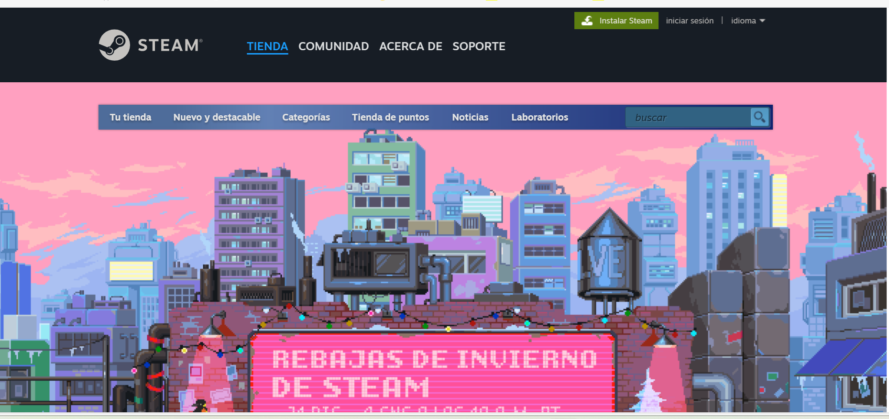
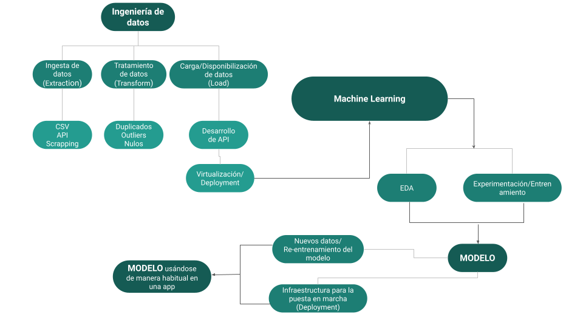

# PROYECTO INDIVIDUAL Nº1
## Machine Learning Operations (MLOps)

### Juegos de video en línea STEAM Juegos (steampowered.com)

### Amelia Herrera Briceño - melinnicri@gmail.com

### Mayo, 2024

## Descripción del problema: 
El ciclo de vida de un proyecto de Machine Learning contempla desde el tratamiento y recolección de los datos (Data Engineer stuff) hasta el entrenamiento y mantenimiento del modelo de Machine Learning, ML, según llegan nuevos datos.
Se debe empezar desde cero y obtener finalmente un Producto viable mínimo MVP (Minimum viable product).

 <b>Imagen del proceso de transformación de los datos hacia el modelo de ML.</b>

## Propuesta de trabajo (requerimientos de aprobación):
### Transformaciones: 
Para este MVP no se te pide transformaciones de datos (aunque encuentres un motivo para hacerlo) pero trabajaremos en leer el dataset con el formato correcto. Puedes eliminar las columnas que no necesitan para responder las consultas o preparar los modelos de aprendizaje automático, y de esa manera optimizar el rendimiento de la API y el entrenamiento del modelo.

- Se realizaron cambios sutiles en las columnas que eran necesarias, cambiando los NaNs por 0, o el tipo de dato.
- Habían 88.000 NaNs, por lo que se extirpó de raíz (todas las filas) y un dato (en una revisión posterior) que no tenía ningún valor.
- Desanidado de algunas columnas, como genres o reviews.

### Feature Engineering: 
En el dataset user_reviews se incluyen reseñas de juegos hechos por distintos usuarios. Debes crear la columna "sentiment_analysis" aplicando análisis de sentimiento con NLP con la siguiente escala: debe tomar el valor '0' si es malo, '1' si es neutral y '2' si es positivo. Esta nueva columna debe reemplazar la de user_reviews.review para facilitar el trabajo de los modelos de machine learning y el análisis de datos. De no ser posible este análisis por estar ausente la reseña escrita, debe tomar el valor de 1.

- Se hizo un análisis de sentimiento VADER.

### Desarrollo API: 
Propones disponibilizar los datos de la empresa usando el framework FastAPI por medio de Render.

Los 3 archivos originales de la Base de datos y comprimidos ("steam_games.json.gz", "user_reviews.json.gz" y "users_items.json.gz") no se subieron por su gran tamaño. Los tratamientos que se les realizaron se encuentran en carpeta “Archivos_tratados”:
1) ["games.ipynb"](https://github.com/melinnicri/JuegosNewSteam/blob/main/Archivos_tratados/games.ipynb) (no se guardó First_Game_genres.csv)
2) ["items.ipynb"](https://github.com/melinnicri/JuegosNewSteam/blob/main/Archivos_tratados/items.ipynb) (no se guardó Third_Users.csv)
3) ["reviews.ipynb"](https://github.com/melinnicri/JuegosNewSteam/blob/main/Archivos_tratados/reviews.ipynb) (no se guardó Third_Users.csv)
Para armar las combinaciones para las posteriores consultas, se hicieron nuevas dataframes y en la carpeta “Combinaciones”, se encuentra el notebook:

4) ["combinaciones.ipynb"](https://github.com/melinnicri/JuegosNewSteam/blob/main/Combinaciones/combinaciones.ipynb); los archivos .csv ("df_unido_1.csv", "df_unido_2.csv", "df_unido_3.csv", "df_unido_4.csv", "df_unido_5.csv"; para ML: "df_unido_ML01.csv", "df_unido_ML02.csv") no se subieron por el gran tamaño.

5) Las consultas que se propones son las siguientes y se encuentran en la carpeta “Consultas”, con 2 notebooks [“consultas.ipynb”](https://github.com/melinnicri/JuegosNewSteam/blob/main/Consultas/consultas.ipynb) y [“ML_separado.ipynb”:](https://github.com/melinnicri/JuegosNewSteam/blob/main/Consultas/ML_separado.ipynb)
*Para las APIs se subieron solamente los archivos comprimidos y necesarios por Render, en parquet, porque la memoria es poca.

- def developer( desarrollador : str): Cantidad de items y porcentaje de contenido Free por año según empresa desarrolladora.
Ejemplo de retorno: Año Cantidad de Items Contenido Free 2023 50 27% 2022 45 25% Xxxx xx xx%

- def userdata( User_id : str): Debe devolver cantidad de dinero gastado por el usuario, el porcentaje de recomendación en base a reviews.recommend y cantidad de items.
Ejemplo de retorno:
{"Usuario X" : us213ndjss09sdf, "Dinero gastado": 200 USD, "% de recomendación": 20%, "cantidad de items": 5}

- def UserForGenre( genero : str): Debe devolver el usuario que acumula más horas jugadas para el género dado y una lista de la acumulación de horas jugadas por año de lanzamiento.
Ejemplo de retorno:
{"Usuario con más horas jugadas para Género X" : us213ndjss09sdf, "Horas jugadas":[{Año: 2013, Horas: 203}, {Año: 2012, Horas: 100}, {Año: 2011, Horas: 23}]}

- def best_developer_year( año : int): Devuelve el top 3 de desarrolladores con juegos MÁS recomendados por usuarios para el año dado. (reviews.recommend = True y comentarios positivos)
Ejemplo de retorno:
[{"Puesto 1" : X}, {"Puesto 2" : Y},{"Puesto 3" : Z}]

- def developer_reviews_analysis( desarrolladora : str): Según el desarrollador, se devuelve un diccionario con el nombre del desarrollador como llave y una lista con la cantidad total de registros de reseñas de usuarios que se encuentren categorizados con un análisis de sentimiento como valor positivo o negativo.
Ejemplo de retorno:
{'Valve' : [Negative = 182, Positive = 278]}

## Análisis exploratorio de los datos: (Exploratory Data Analysis-EDA)
Ya los datos están limpios, ahora es tiempo de investigar las relaciones que hay entre las variables del dataset, ver si hay outliers o anomalías (que no tienen que ser errores necesariamente), y ver si hay algún patrón interesante que valga la pena explorar en un análisis posterior. Las nubes de palabras dan una buena idea de cuáles palabras son más frecuentes en los títulos, ¡podría ayudar al sistema de predicción! En esta ocasión vamos a pedirte que no uses librerías para hacer EDA automático ya que queremos que pongas en práctica los conceptos y tareas involucrados en el mismo.

En el notebook de la carpeta Archivos tratados:
*Hay gráficos para algunas variables.

1.- ["games.ipynb"](https://github.com/melinnicri/JuegosNewSteam/blob/main/Archivos_tratados/games.ipynb):
De acuerdo a la descripción de Frecuencia de los datos, las distribuciones parecen normales (hay que calcular en una próxima oportunidad):
Los géneros de videojuegos que más se repiten son del tipo Indie (que son obras desarrolladas por estudios independientes que buscan explorar el medio desde un punto de vista personal, fresco y estéticamente atractivo. Estas creaciones no se
limitan a un género específico, sino que abarcan una amplia variedad), unas 15858 veces (dentro de 23 géneros).
El nombre de App o de juego que más se repite (11 veces) es AutoTileSet (juego de niveles).
En Precios hay 114 valores únicos. El valor más frecuente es 5.0 dólares, que aparece 9 900 veces.
El id de usuario que más se repite es 313 320, y aparece unas 11 veces. Hay 32 133 id de usuarios únicos.
Hay 10 993 desarrolladores únicos en la columna “developer”.
El desarrollador más frecuente tiene un valor de 0 (quizás representa valor nulo, sin nombre) y aparece 3 478 veces.
El año en que más se jugó puede ser el 2017, con una frecuencia de 25 352 veces.
El mes que más se repitió fue Octubre y los primeros días de mes (3 401 veces).

2.- ["reviews.ipynb"](https://github.com/melinnicri/JuegosNewSteam/blob/main/Archivos_tratados/reviews.ipynb):
La mayoría de las recomendaciones son a favor de jugar (True en mayor frecuencia), más de 50.000 valores por sobre los que no recomiendan videojuegos, False (- de 10.000 valores).
Los sentimientos (del análisis de sentimientos) vienen de las reseñas de los usuarios de videojuegos: 2 es positivo (más frecuente en las reseñas), 1 es neutral, 0 es negativo (son los menos).
Más de 40.000 valores para 2, 10.000 valores para 1, cerca de 9.000 valores para 0.
Los datos totales para cada columna son 5 153 209.

3.- ["items.ipynb"](https://github.com/melinnicri/JuegosNewSteam/blob/main/Archivos_tratados/items.ipynb):
Los datos totales para cada columna son 5 153 209.
items_count: Este es el número total de elementos (por ejemplo, juegos o aplicaciones).
El valor mínimo es 1, lo que significa que al menos se tiene un elemento en los datos.
El valor máximo es 7 762, lo que sugiere que hay un máximo de 7 762 elementos.
Un promedio de 314 +/- 693 items (existe cierta variabilidad con el número de items).
playtime_forever: Esta variable representa el tiempo total de juego acumulado por cada elemento (en horas).
El valor mínimo es 0, lo que indica que algunos elementos no han sido jugados en absoluto.
El valor máximo es 642 773 horas, lo que significa que hay un tiempo de juego extremadamente alto.
Un promedio de 991 +/- 5418 horas de juego total (aquí la variabilidad es mucho mayor en las horas de juego total, posibles outliers).
playtime_2weeks: Esta variable muestra el tiempo de juego acumulado en las últimas dos semanas para cada elemento (en horas).
El valor mínimo es 0, lo que sugiere que algunos elementos no se han jugado en las últimas dos semanas.
El valor máximo es 19 967, lo que indica que hay un tiempo de juego significativo en ese período.
Un promedio de 9 +/- 140 horas de juego total en las últimas dos semanas (acá la variabilidad es menor que en tiempo total).
En resumen, estos valores proporcionan información sobre la distribución y variabilidad de los datos relacionados con los elementos (items), su tiempo de juego acumulado y su actividad reciente.

## Modelo de aprendizaje automático:
Una vez que toda la data es consumible por la API, está lista para consumir por los departamentos de Analytics y Machine Learning, y nuestro EDA nos permite entender bien los datos a los que tenemos acceso, es hora de entrenar nuestro modelo de machine learning para armar un sistema de recomendación. Para ello, te ofrecen dos propuestas de trabajo: En la primera, el modelo deberá tener una relación ítem-ítem, esto es se toma un item, en base a que tan similar esa ese ítem al resto, se recomiendan similares. Aquí el input es un juego y el output es una lista de juegos recomendados, para ello recomendamos aplicar la similitud del coseno. La otra propuesta para el sistema de recomendación debe aplicar el filtro user-item, esto es tomar un usuario, se encuentran usuarios similares y se recomiendan ítems que a esos usuarios similares les gustaron. En este caso el input es un usuario y el output es una lista de juegos que se le recomienda a ese usuario, en general se explican como “A usuarios que son similares a tí también les gustó…”. Deben crear al menos uno de los dos sistemas de recomendación (Si se atreven a tomar el desafío, para mostrar su capacidad al equipo, ¡pueden hacer ambos!). Tu líder pide que el modelo derive obligatoriamente en un GET/POST en la API símil al siguiente formato:

- Carpeta Consultas: [“ML_separado.ipynb”](https://github.com/melinnicri/JuegosNewSteam/blob/main/Consultas/ML_separado.ipynb).

Si es un sistema de recomendación item-item:
- def recomendacion_juego(id de producto): Ingresando el id de producto, deberíamos recibir una lista con 5 juegos recomendados similares al ingresado. 

Si es un sistema de recomendación user-item:
- def recomendacion_usuario(id de usuario): Ingresando el id de un usuario, deberíamos recibir una lista con 5 juegos recomendados para dicho usuario. 

### //FIN … _@v
